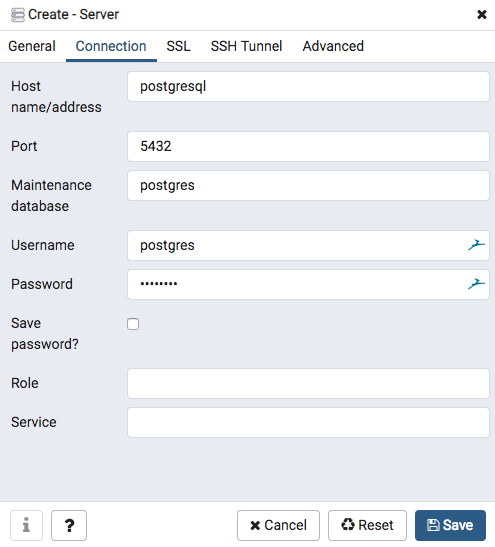

# Database

## Administration with PgAdmin

PgAdmin can be accessed through `http(s)://<node domain name>/pgadmin` with username `admin` and password `admin` \(by default\). To access the test database just create a server with the name `MedCo`, the address `postgresql`, username `postgres` and password `postgres` \(by default\). Note that PgAdmin is not included in the production deployments.

