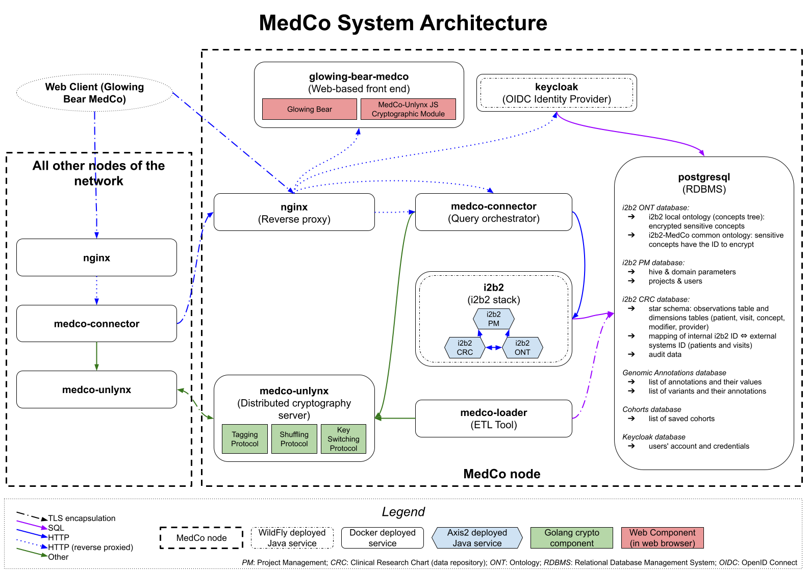

# System Architecture

### Containers

#### medco-connector

Component orchestrating the MedCo query at the clinical site. Implements the resource-side of the PIC-SURE API. It communicates with _medco-unlynx_ to execute the distributed cryptographic protocols. [Sources on GitHub](https://github.com/ldsec/medco-connector).

#### medco-unlynx

The software executing the distributed cryptographic protocols, based on Unlynx. [Sources on GitHub](https://github.com/ldsec/medco-unlynx).

#### glowing-bear-medco

Nginx web server serving Glowing Bear and the javascript crypto module. [Sources on GitHub](https://github.com/ldsec/glowing-bear-medco).

#### medco-loader

ETL tool to encrypt and load data into MedCo. [Sources on GitHub](https://github.com/ldsec/medco-loader).

#### i2b2

The i2b2 stack \(all the cells\). [Project website](https://www.i2b2.org/).

#### keycloak

OpenID Connect identity provider, providing user management and their authentication to MedCo. [Project website](https://www.keycloak.org/).

#### postgresql

The SQL database used by all other services, contains all the data. [Project website](https://www.postgresql.org/).

#### pg-admin

A web-based administration tool for the PostgreSQL database. [Project website](https://www.pgadmin.org/).

#### nginx

Web server and \(HTTPS-enabled\) reverse proxy. [Project website](https://www.nginx.com/).

