# Live Demo Tutorial

## Background

Medco is a privacy-preserving federated analytics platform allowing to perform secure distributed analytics on data from several clinical sites. Medco is a project driven by the Swiss Personalized Health Network \(SPHN\) \[1\] and Data Protection for Personalized Health \(DPPH\) \[2\] initiatives and developed at Ecole Polytechnique Fédérale de Lausanne \(EPFL\) and Centre Hospitalier Universitaire Vaudois \(CHUV\). This is also made possible by joint efforts of Hopitaux Universitaires de Genève \(HUG\) and Inselspital. Some terminologies available in this demo are in French, as the demo deployment is built from metadata available at CHUV. Other versions can be installed depending on the clinical site or researcher language. MedCo offers cross-compatibility between languages. It does not explain the technical details of the underlying technology nor the deployment process. Please refer to the Medco website \[3\] for publications and technical details.

This tutorial presents a few relevant uses-cases of Medco \[4\], to understand its wide range of possibilities. We will pass through the Explore and Analysis functionalities. All the data in this demo are synthetic and do not belong to any company or institution. Synthetic data are derived from the ontology of the Swiss Personalized Oncology \(SPO\) program supported by the Swiss Personalized Health \(SPHN\) initiative.

1. Do a simple age-constrained cohort selection
2. Try a realistic oncology query and use the Medco-Analysis feature for survival curves

## Login

The Medco Live Demo client is available at the following address: [medco-demo.epfl.ch/glowing-bear](https://medco-demo.epfl.ch/glowing-bear). The initial screen asks for credentials. For this demo, you can use these :

Username: **test** / Password: **test**

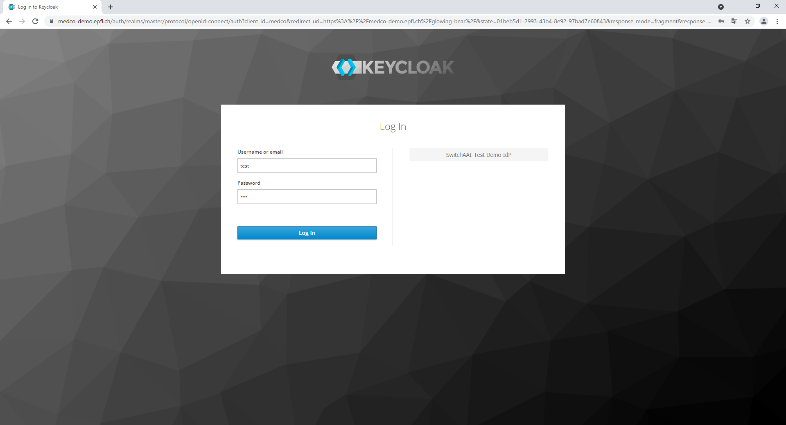

## A simple age query

In the left side of the user interface is an ontology browser. The ontology browser enables you to explore the variables that might be contained in the database and identify the ones that you would like to use for your query. Variables in the ontology browser are organized in a tree-like fashion and can be explored as a file system made of folders and files. Most of the times variables and hierarchies are taken from standard medical terminologies and classifications. The goal is to drag-and-drop criteria for cohort selection into the right-side panel called **inclusion criteria**.

1. Select in the MedCo Explore query parameters the option "**Selected groups occur in the same instance"**.  
2. On the left sidebar, expand the ontology \(SPHN-SPO ontology\), then the _Birth Datetime_ group, then expand it to reveal _Birth Year-value_. Drag-and-drop this _Birth Year-value_ element to the right panel.

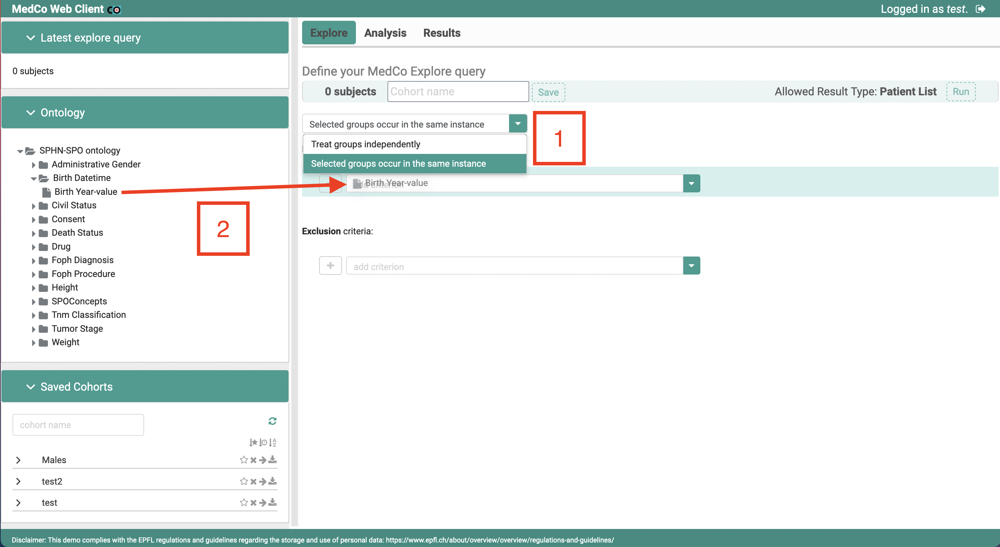

3. Uncheck the option **Same instance**.  
4. Below, an input field has appeared: select _greater than_.  
5. Next to this field, type _1980_.

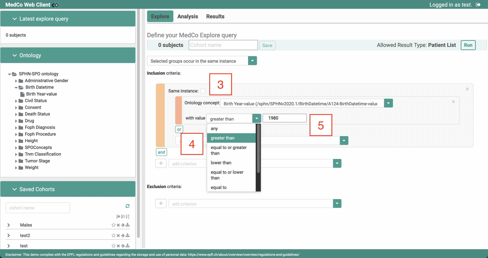

6. On the left sidebar, expand the _Drug_ group, then _Drug\_code_, then finally _ATC_. Drag-and-drop the _Nervous system drugs \(N\)_ element to the right panel.  
7. Uncheck the option **Same instance**.  
8. On the left sidebar, expand the _SPOConcepts_ group, then _Somatic Variant Food_. Drag-and-drop the _Gene\_name_ element to the right panel.  
9. An input field has appeared: select _exactly matches._  
10. Next to this field, type _HRAS_.  
11. On the left sidebar, also in the _Somatic Variant Food_, drag-and-drop the _Hgvs\_c_ element to the right panel.  
12. An input field has appeared: select _contains_.  
13. Next to this field, type _6994_.

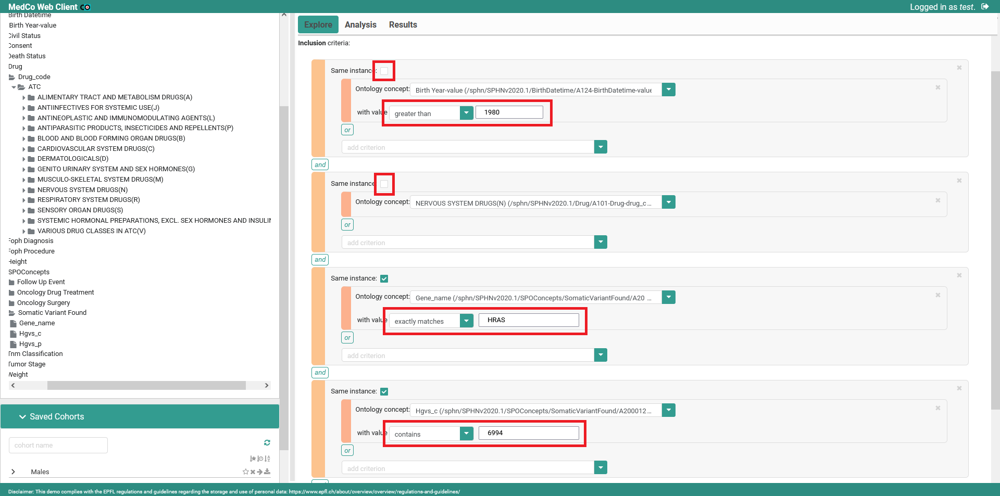

Now we have selected the **Inclusion** criteria, we can add a **Exclusion** criteria :

1. On the left sidebar, expand the _Constent_ group, then _Status_. Drag-and-drop the _Refused_ element to the right panel in the **Exclusion** area. Uncheck the option **Same instance**.  
2. On the left sidebar, also in the _Constent_ group, extend the _Type_ group. Drag-and-drop the _Waiver_ element to the right panel in the **Exclusion**’s **OR** area.

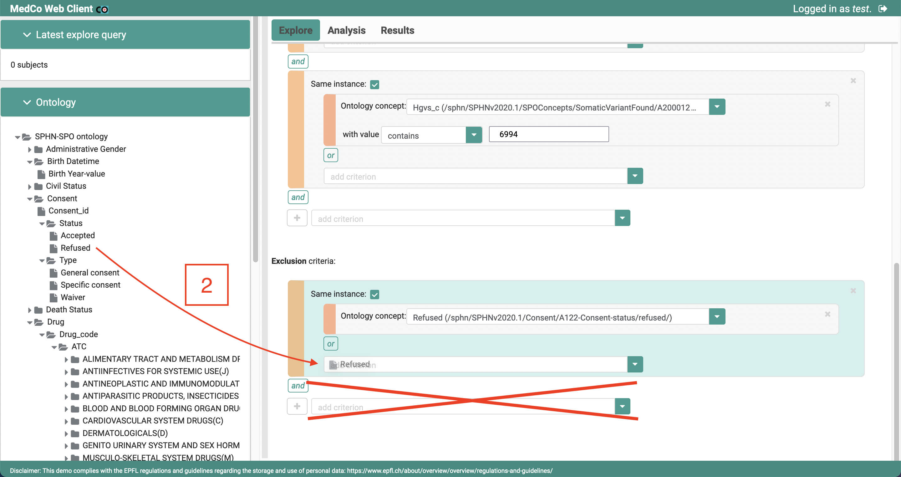

3. Click _Run_. After few seconds of loading, the number of subjects is displayed at the top.

## Survival Analysis

In this part, we first need to build and run a Query to have some subjects, and then run some analysis on it. Finally, we can see the results of the analysis and change some visualization parameters.

1. Browse the ontology panel again to expand _SPHN-SPO ontology_, then _SPOConcepts_. Drag-and-drop the _Oncology Drug Treatment_ element to the right panel in the **Inclusion** area.

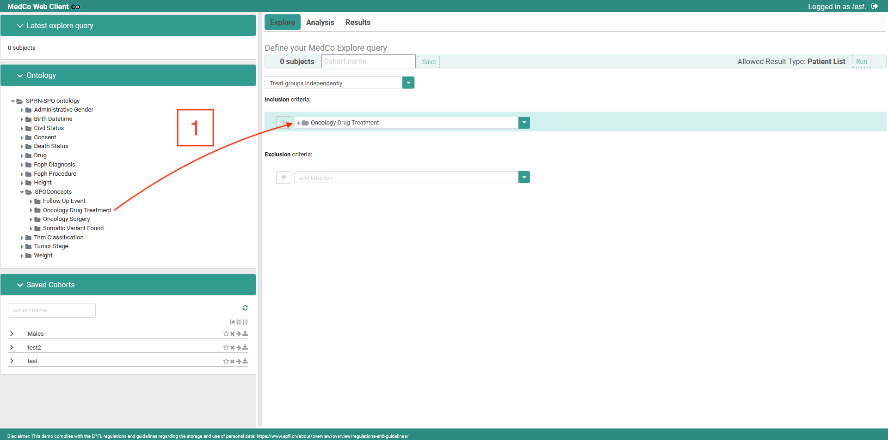

2. Click _Run_ at the top. After few seconds of loading, the number of subjects is displayed.  
3. Name the Cohort as _had\_treatment_ and click on **Save**. The Cohort appear on the left panel, below **Saved Cohorts**.

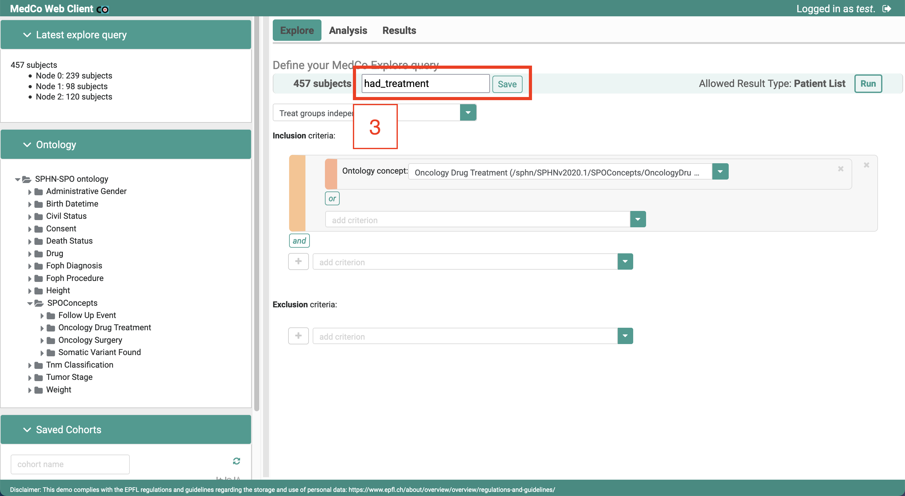

4. The Cohort is now saved, click on it to select it.

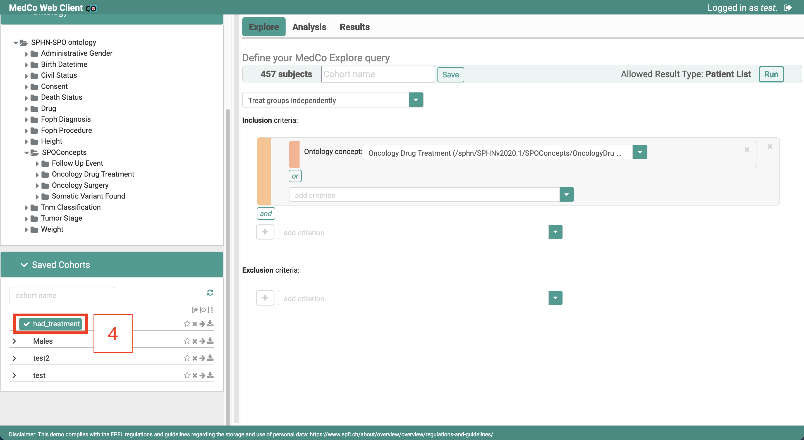

5. Click on the _Analysis_ tab at the top of the page then on _Survival_.

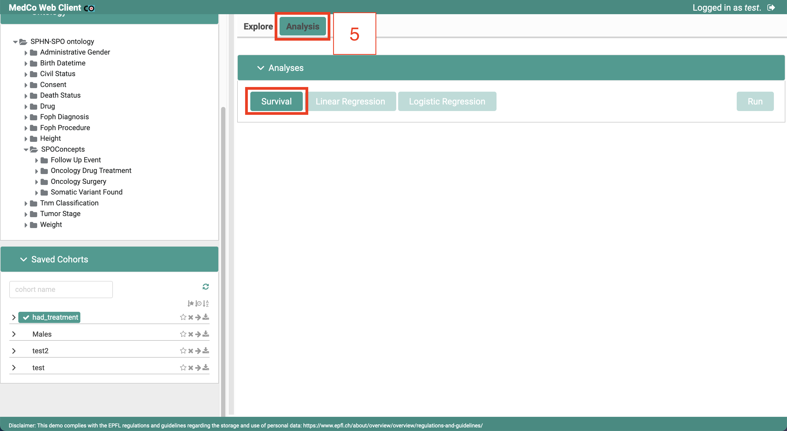

6. Open the _Settings_ panel, and set a _Time Limit_ of **20 years**.

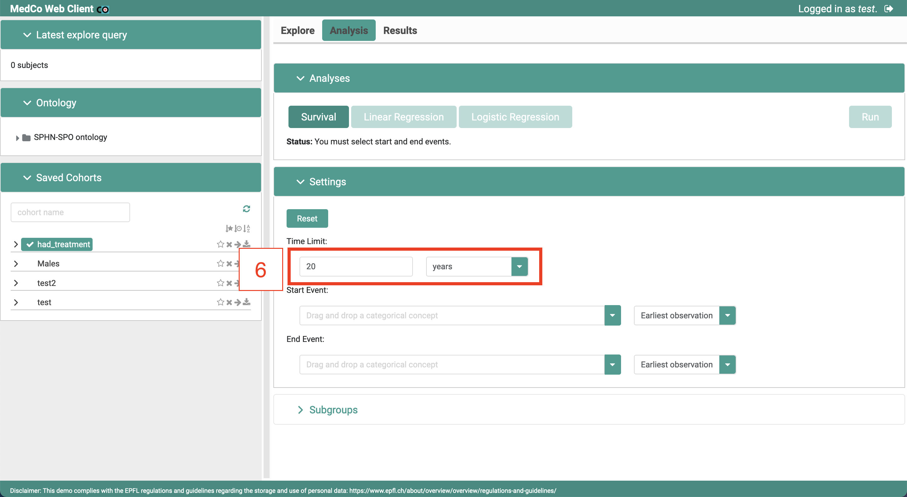

7. Drag-and-drop the _Oncology Drug Treatment_ element in the right panel as a _Start Event_.

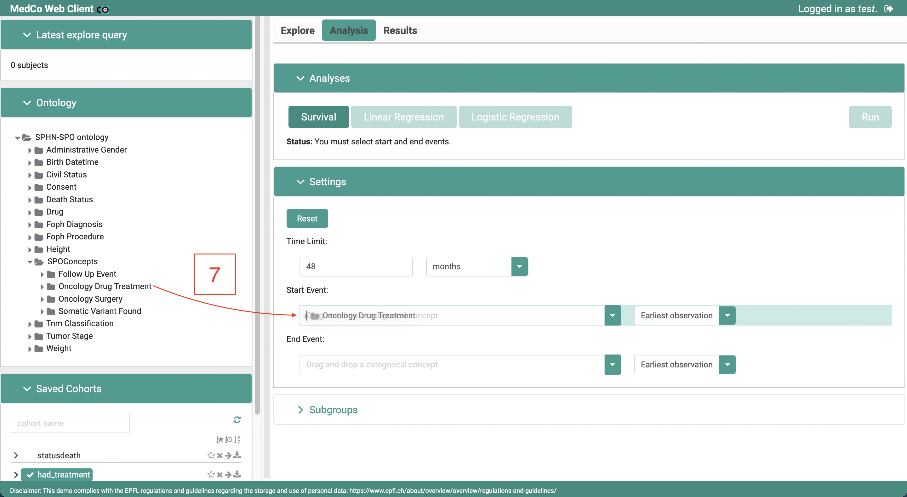

8. Browse the ontology panel again to expand _Death Status_, then _Status_. Drag-and-drop the _Death_ element to the right panel as a _End Event_.

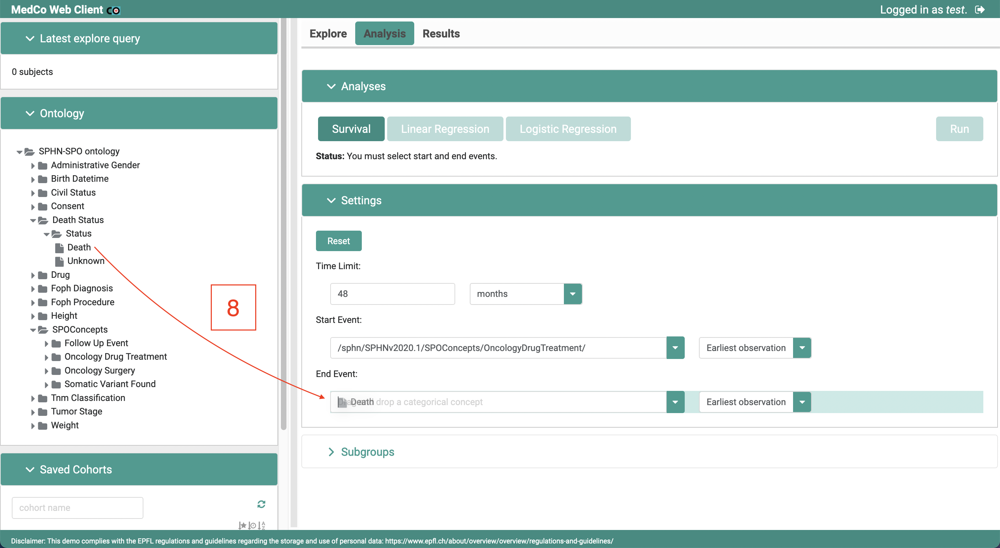

9. Open the _Subgroups_ panel, and set the first subgroup name as **surgery**.

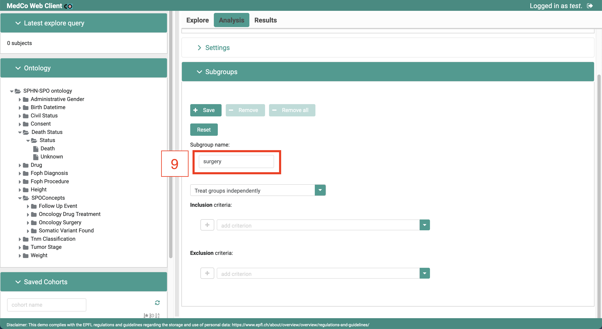

10. Drag-and-drop the _Oncology Surgery_ element in the right panel in the _Inclusion criteria_ area. Click on _Save_ to save the subgroup.

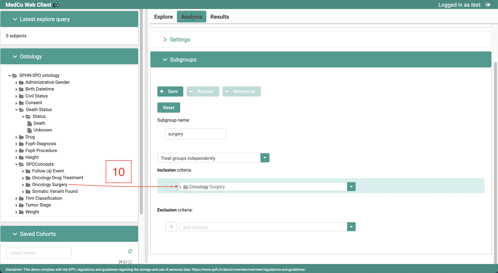

11. Set the second subgroup name as **no\_surgery**.  
12. Drag-and-drop the _Oncology Surgery_ element in the right panel in the _Exclusion criteria_ area. Click on _Save_ to save the subgroup.

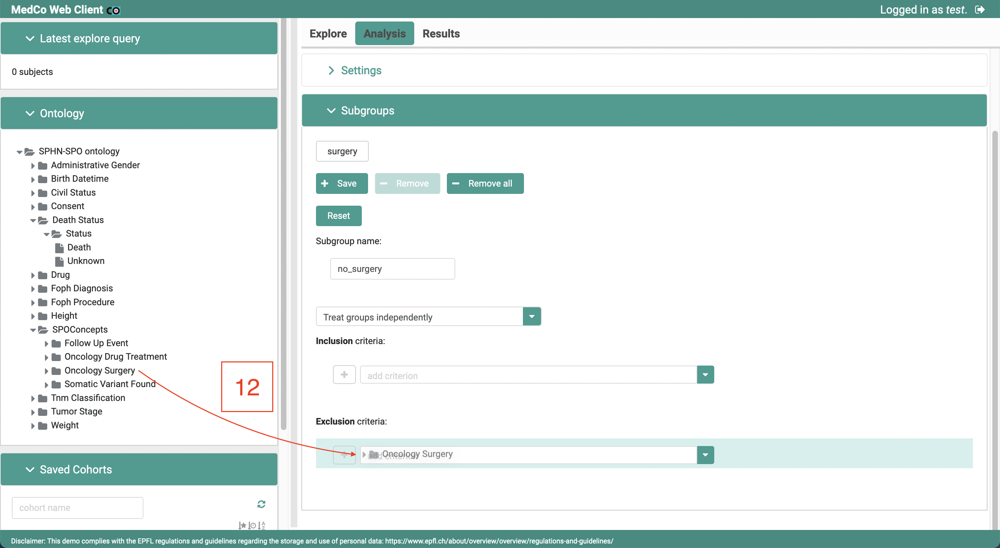

13. Click on _Run_.

14. After a few seconds of loading, the result is displayed. By opening the _Input parameters_ panel, you can have more details about the query.  
15. Click on the cog icon to open the panel to edit the _Confidence interval_ of the graphical representation. In this panel, you can change diverse parameters to alter the graphical representation. When you have finished, you can close this panel.

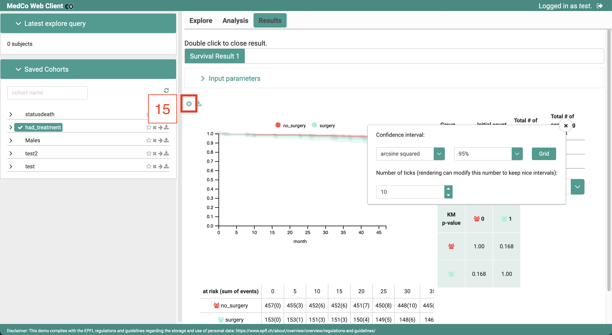

16. On the right side, you can also choose the shown tabular scores.

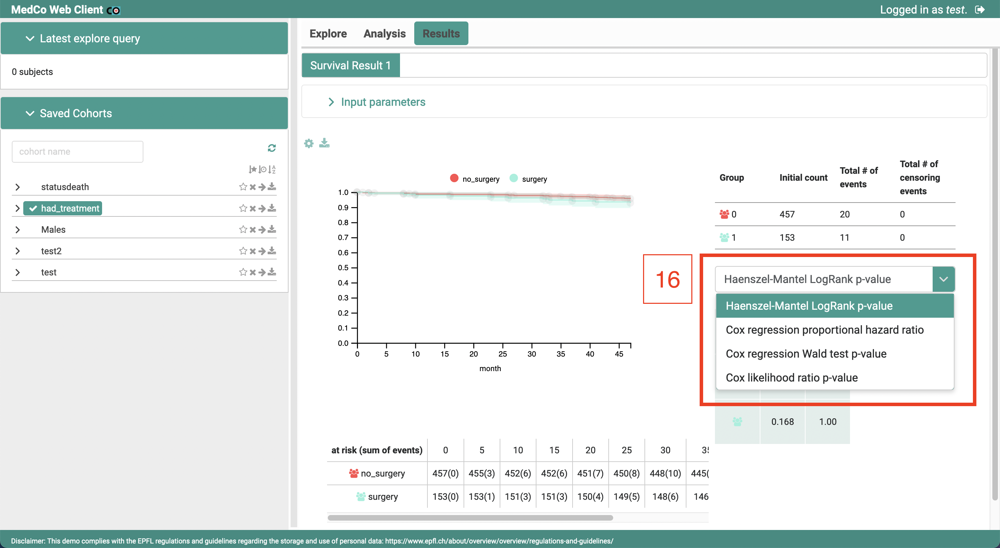

17. Finally, you can download the results as a **PDF** by clicking on the download icon.

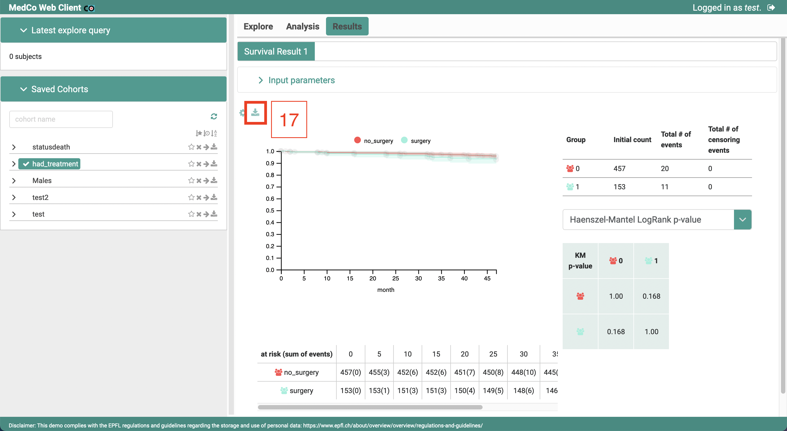

## Conclusion

Few exploration and analysis features available in Medco were presented in this document, more are available and all can be combined with no limitations. No adaptation were made to the data, excepted for the tabular vs. graph representation. In particular, no links were lost nor tampered with. Every edge in the semantic graphs \(e.g every relation between a patient and its diagnosis or its treatment\) is preserved. The Medco database uses visit \(encounter\) identifiers, patient pseudo-identifiers, instance \(observation\) identifiers that are not shown to the user. As a consequence, using Medco does not inherently add any usability penalty compared to the original clinical data.

## References

\[1\] “Swiss personalized health network,” [https://sphn.ch/](https://sphn.ch/), accessed: 2021-02-26. \[2\] “Data protection in personal health,” [https://dpph.ch/](https://dpph.ch/), accessed: 2021-02-26. \[3\] [https://medco.epfl.ch/](https://medco.epfl.ch/), accessed: 2021-02-26. \[4\] J. L. Raisaro, J. R. Troncoso-Pastoriza, M. Misbach, J. S. Sousa, S. Pradervand, E. Missiaglia, O. Michielin, B. Ford, and J.-P. Hubaux, “Medco: Enabling secure and privacy-preserving exploration of distributed clinical and genomic data,” IEEE/ACM transactions on computational biology and bioinformatics, vol. 16, no. 4, pp. 1328–1341, 2018.

