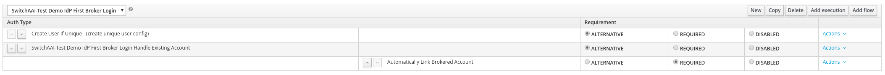
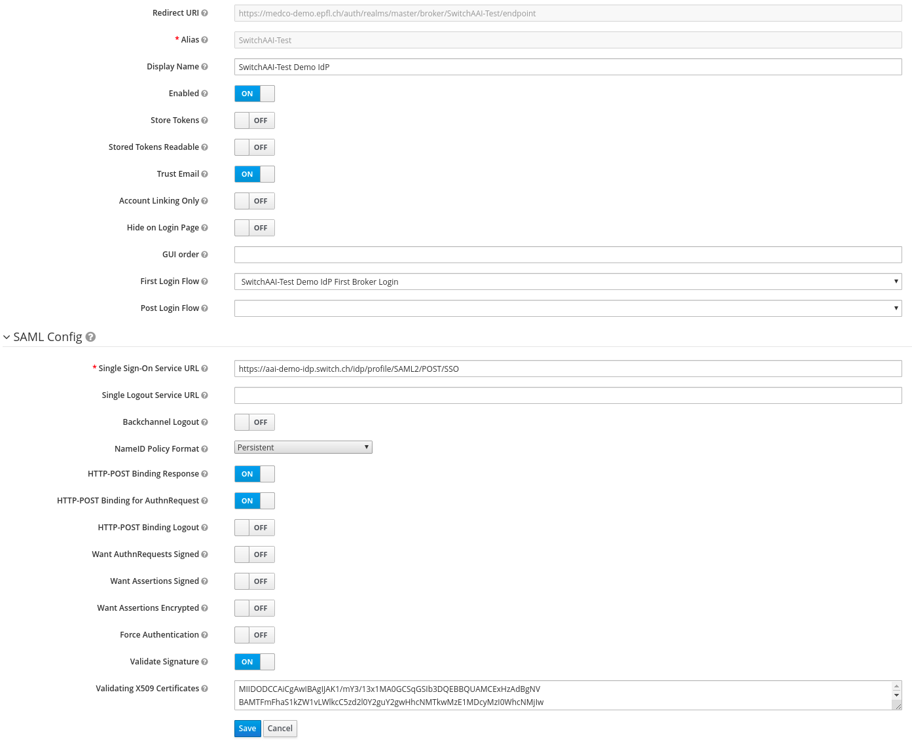
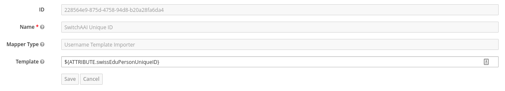
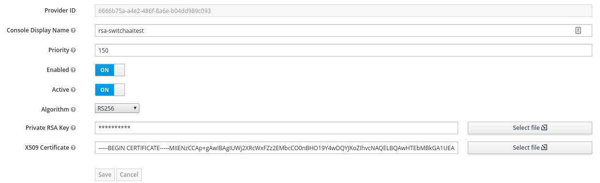
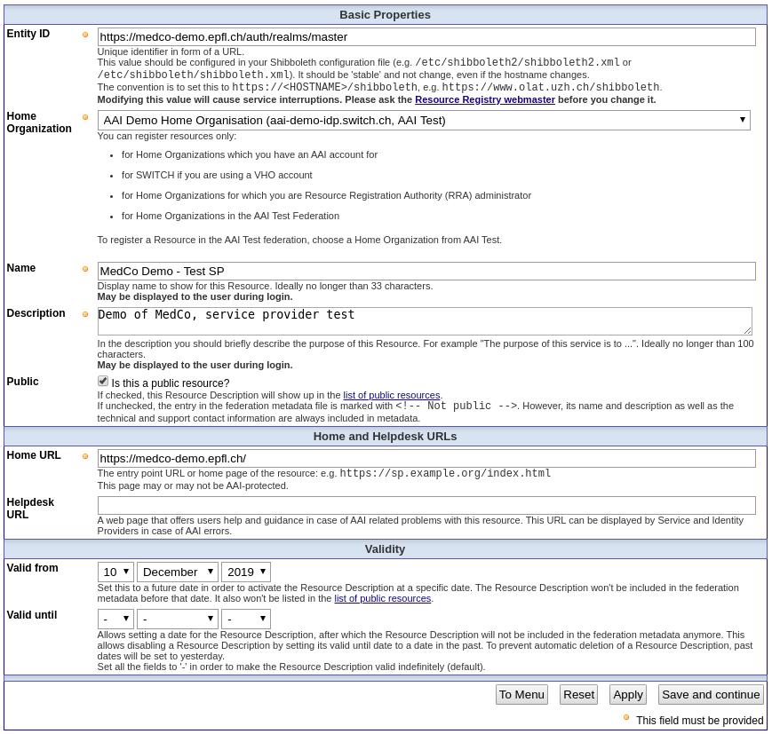
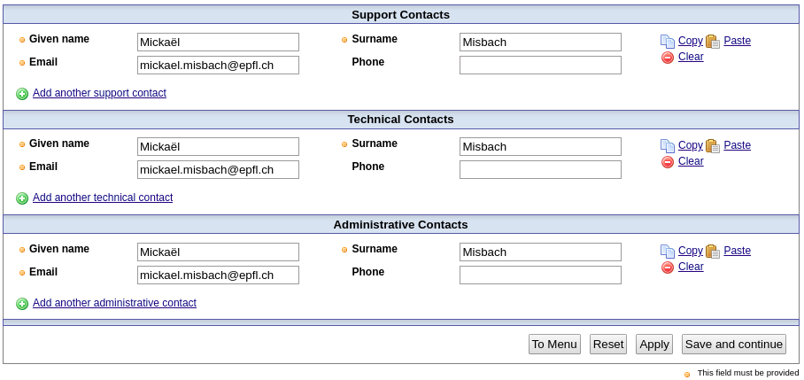
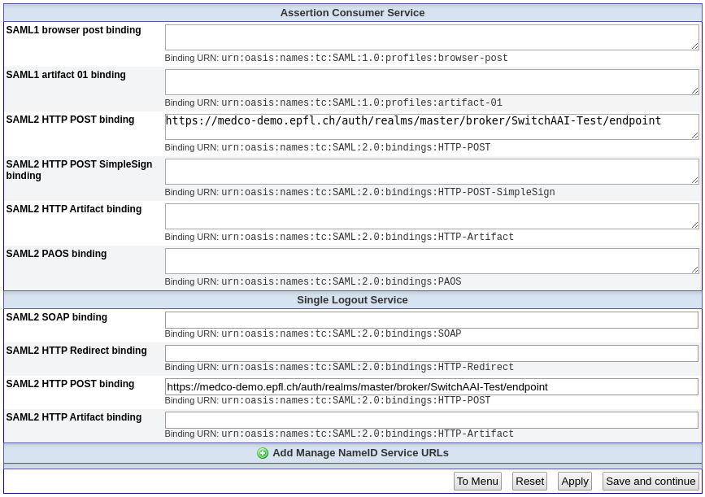
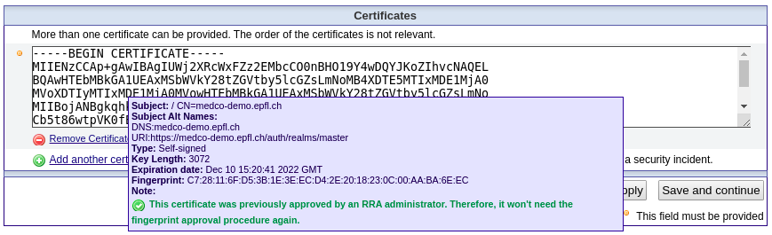
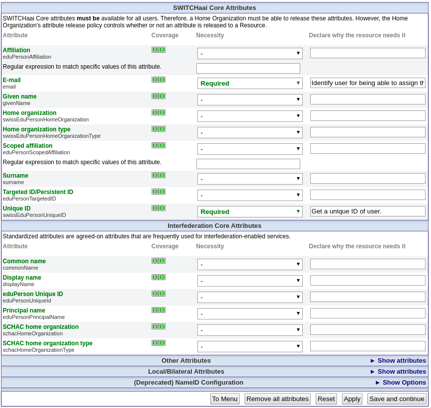
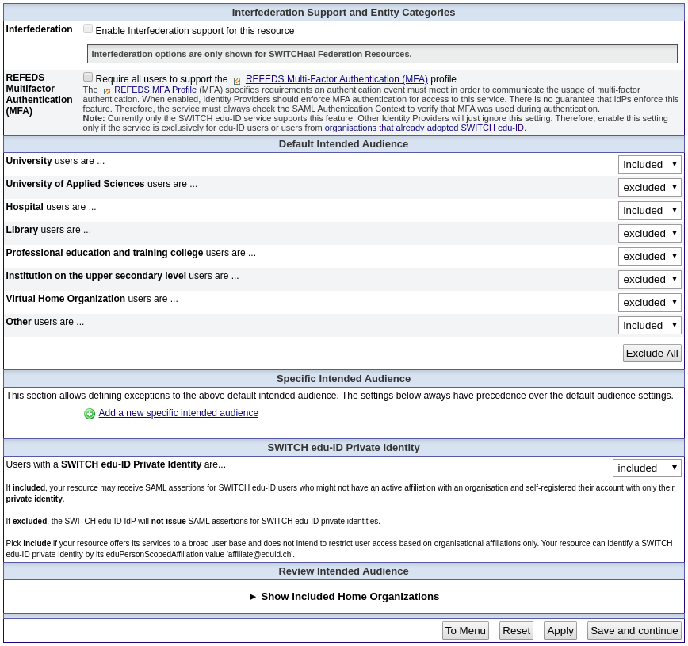

# Configuring SwitchAAI Authentication

## Prerequisites

* A MedCo network is up and running, with one or more functional Keycloak within the network.
* One or several identity provider\(s\) part of the SwitchAAI federation is/are chosen to be used as user source.
* The institution at which the Keycloak of MedCo is deployed is ready to accept being registered as the home organization. 
* You have access to the [SwitchAAI Resource Registry](https://rr.aai.switch.ch/).


Right now the SwitchAAI WAYF \(Where Are You From\) mechanism is not supported \(i.e. the web UI used to select with institution the user wishes to login\). This means that you will need to register in Keycloak each identity provider you wish to support.



The process described in this guide will need to be repeated for each instance of Keycloak deployed, if there are more than one in the MedCo network.


## Configure the identity provider\(s\) in Keycloak

The following instructions are to be executed on the administration UI of Keycloak, e.g. `https://medco-demo.epfl.ch/auth/admin`.

### Configure the first login flow

The behavior of Keycloak during the very login of users through the identity provider is highly customisable. We propose below an example of a working flow but this can be changed to fit your need. 

* Navigate to _Authentication_ &gt; _Flows,_ select _First Broker Login_ and make a _Copy_ of it. Name it for example `SwitchAAI-Test Demo IdP First Broker Login`.
* Change the list of executions to make it look like the following image.

### Add the identity provider

* In the _Identity Providers_ menu, choose `Add provider...` &gt; `SAML v2.0`
* Specify an _Alias_. Note this will not be changeable later without redoing the whole process. Example: `SwitchAAI-Test`.
* Specify a _Display Name_, which will be displayed to the user in the login page. Example: `SwitchAAI-Test Demo IdP`.
* Specify the _Single Sign-On Service URL_ of the identity provider you are linking with. Example: `https://aai-demo-idp.switch.ch/idp/profile/SAML2/POST/SSO`.
* Specify the _First Login Flow_ previously configured to use. Example: `SwitchAAI-Test Demo IdP First Broker Login`.
* Toggle to `ON` the following buttons: 
  * _Enabled_
  * _Trust Email_
  * _HTTP-POST Binding Response_
  * _HTTP-POST Binding for AuthnRequest_
  * _Validate Signature_
* Specify the _NameID Policy Format_ as `Persistent`.
* Add the certificate\(s\) \(PEM format, separated by commas if there are several of them\) of the identity provider you are linking with in _Validating X509 Certificates_.
* Save the changes.

### Add the username mapper

We need to import a unique but intelligible username in Keycloak from the identity provider. For this we use the SwitchAAI mandatory attribute _swissEduPersonUniqueID_.

* Open the _Mappers_ tab and click _Create_.
* Fill the field as:
  * _Name:_ `SwitchAAI Unique ID`.
  * _Mapper Type:_ `Username Template Importer`.
  * _Template:_ `${ATTRIBUTE.swissEduPersonUniqueID}`
* Save the changes.

### Setup a certificate

A certificate compliant with the SwitchAAI federation needs to be generated and configured. First[ follow this SwitchAAI guide](https://www.switch.ch/aai/support/certificates/embeddedcerts-requirements-appendix-a/) to generate a self-signed certificate that meets their requirements. You will need from the Keycloak instance:

* Its _FQDN_ \(fully-qualified domain name\). Example: `medco-demo.epfl.ch`.
* Its SAML _entityID_, that you can find out in the XML descriptor from the _Export_ tab of the previously configured Keycloak identity provider. __Example: `https://medco-demo.epfl.ch/auth/realms/master`.

Once you have generated the certificate, set it up in Keycloak:

* Navigate to the settings page _Realm Settings_ &gt; _Keys_ &gt; _Providers_ and select _Add Keystore..._ &gt; _rsa_.
* Specify a name in _Console Display Name_. Example: `rsa-switchaaitest`.
* Specify a _Priority_ higher than any other RSA key. Example: `150`.
* In _Private RSA Key_ and _X509 Certificate_ fields, copy/paste the respective PEM parts of both the private key and the certificate that were previously generated.

## Register Keycloak instance as a Service Provider in SwitchAAI

The following instructions are to be executed in the [AAI Resource Registry](https://rr.aai.switch.ch/menu_res_options.php). As a result, a Keycloak instance will be registered as a service provider linked to a home organization in the SwitchAAI federation.

### Register new resource

Click _Add a Resource Description_ and fill the 7 categories of information according to the following instructions. Note that if some fields are not listed in this documentation, their value are not important for the registration of the Keycloak instance and can be set according to the explanations provided by the resource registry.

#### 1. Basic Resource Information

* _Entity ID_: the same SAML entityID you used to generate the certificate. Example: `https://medco-demo.epfl.ch/auth/realms/master`.
* _Home Organization_: the organization that hosts the Keycloak instance currently being registered. The responsible persons of the organization specified here will need to approve the registration. This will typically be the the institution where the MedCo node is deployed. For the purpose of our test we are using `AAI Demo Home Organization (aai-demo-idp.switch.ch, AAI Test)`.
* _Home URL_: the address of the MedCo node, at which the UI Glowing Bear can be accessed. Example: `https://medco-demo.epfl.ch/`.

#### 2. Descriptive Information

#### 3. Contacts

#### 4. Service Locations

* _SAML2 HTTP POST binding_ \(x2\): the URL at witch the SwitchAAI infrastructure will communicate with the Keycloak instance. You will find it in the configuration page of the configured identity provider in Keycloak under _Redirect URI_. Example: `https://medco-demo.epfl.ch/auth/realms/master/broker/SwitchAAI-Test/endpoint`

#### 5. Certificates

Copy/paste in this field the PEM part of the certificate that was previously generated. Note that in the example showed below the certificate has already been validated through a separate channel. 

#### 6. Requested Attributes

Put on `Required` at least the following attributes. Note that the release of attributes needs to have a justification.

* _E-mail \(email\)_. Example reason: `Identify user for being able to assign them specific authorizations.`
* _Unique ID \(swissEduPersonUniqueID\)_. Example reason: `Get a unique ID of user.`

#### 7. Intended Audience and Interfederation

### Get the new resource approved

Once submitted, the responsible persons from the home organization will need to approve the new resource and validate the fingerprint of the certificate submitted. This is a manual process that will most likely be done through email. 

Once this is done, the setup should be functional, and the users will be able to select the configured identity provider to login. Don't forget that this covers only users' authentication, their authorization needs to be handled manually through Keycloak after they login at least once.

