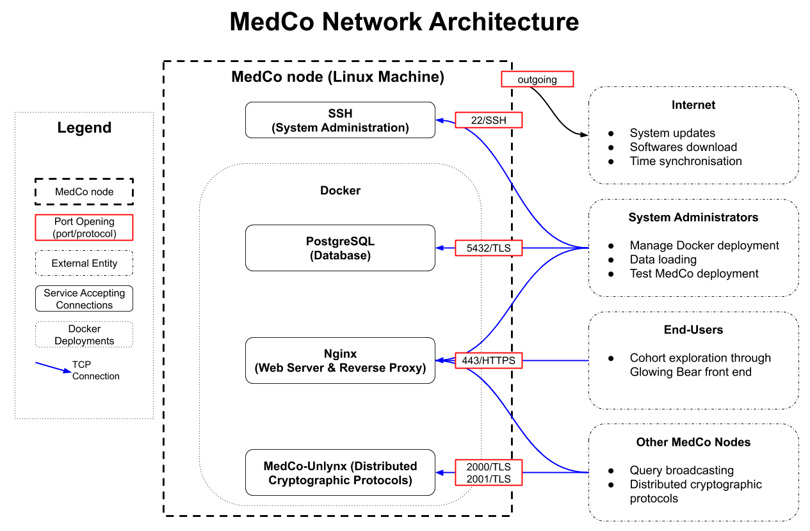

# Network Architecture

## External Entities

Entities that need to connect to a machine running MedCo can be categorized as follow:

* **System administrators**: Persons administrating the MedCo node. Likely to remain inside the clinical site internal network.
* **End-users**: Researchers using MedCo to access the shared. Likely to remain inside the clinical site internal network.
* **Other MedCo nodes**: MedCo nodes belonging to other clinical sites of the network.

## Firewall Ports Opening

The following ports should be accessible by the listed entities, which makes IP address white-listing possible:

* Port 22, 5432 \(TCP\): System Administrators
* Port 80 \(TCP\): End-Users \(HTTP automatic redirect to HTTPS \(443\)\)
* Port 443 \(TCP\): System Administrators, End-Users, Other MedCo Nodes
* Ports 2001-2002 \(TCP\): Other MedCo Nodes

